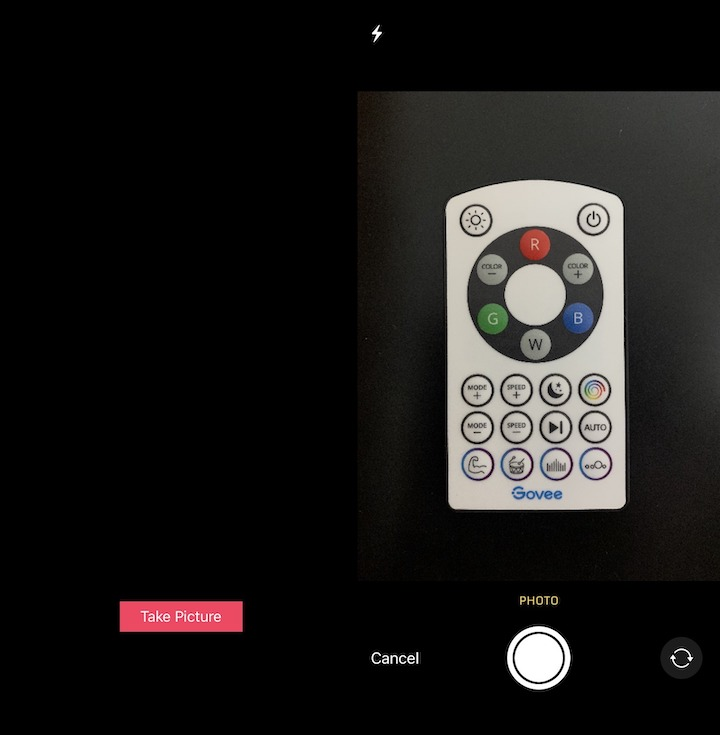
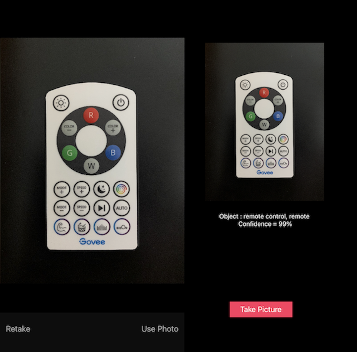

# Picture Identifier
This is a simple IOS application that uses Machine Learning to classify the dominant object in a camera frame or picture. 

## Part 1
The application asks the user to take a picture and uses Residual Neural Network models 50 layers deep (**Resnet50**) to identify the main object in view. 
The on device inference is handled by **CoreML**. 

